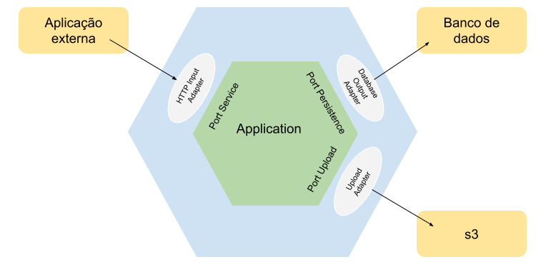

### Exemplo de arquitetura hexagonal para um serviço de cadastro de itens

Diagrama:

Endpoints:

* Documentação: http://localhost:5000/apidocs/
* Cadastrar item: POST http://127.0.0.1:5000/item - {"name": "table", "price": "150.00"}
* Recuperar item pelo nome: GET http://127.0.0.1:5000/item/table
* Recuperar todos os itens: GET http://127.0.0.1:5000/item
* Atualizar item: PUT http://127.0.0.1:5000/item/table - {"name": "table", "price": "150.00"}
* Deletar item: DELETE http://127.0.0.1:5000/item/table
